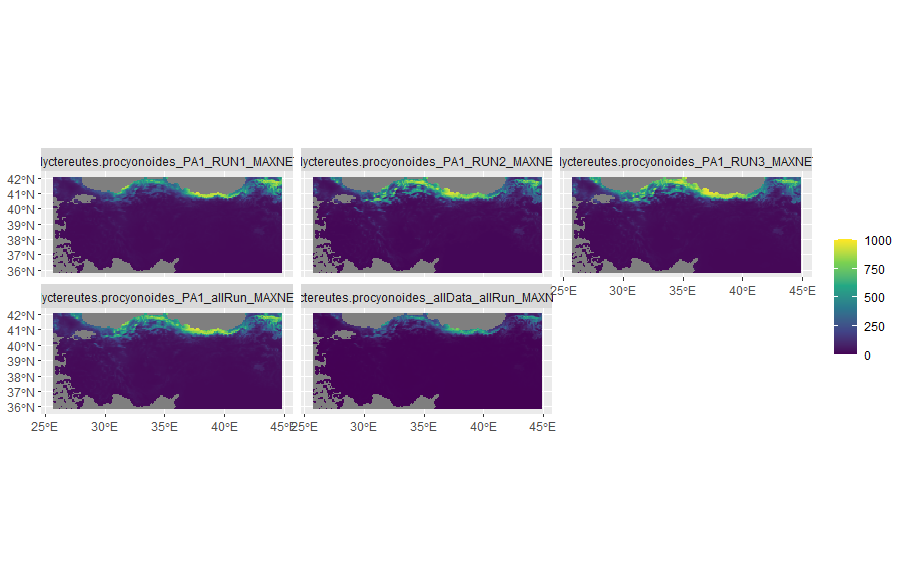

```{=html}
<style>
body {
text-align: justify}
</style>
```
\pagebreak

# INTRODUCTION

Invasive species are considered one of the greatest threats to biodiversity and economics. Natively habituating eastern Siberia, northern China, North Vietnam, Korea and Japan, the Raccoon dog “Nyctereutes procyonoides” is a species that belongs to the Canid family and are closely related to foxes. The species was introduced to Europe in the last century when around 9000 individuals were introduced as a source of fur production. Since then, its expansion has widely increased from Nordic countries down towards central Europe since the first report in France. Moreover, hunting statistics showed dramatic increase in hunting records by the end of 90s [@weber2004].

Together with other non-native rodent species, Raccoon dogs have a wide spectrum of preys and can easily adapt, which makes them livable in almost any natural habitat, threatening indigenous species such as reptiles and ground-nesting birds. The first occurrence for this species in Turkey was reported in 2019 near the Sarıkamış region [@naderi2020]. It is, therefore, of importance to model and predict its spread in the near future.

Ironically, a nature article postulated that the recently occurring COVID-19 pandemic might have been transferred through raccoon dogs in the Wuhan market. Despite the irony, this raises concerns regarding the transmissiblity of infections and viruses zoonoses by means of close interactions with this species [@mallapaty2023]. The aim here is to investigate their current occurrence given specific climatic variables and future spread in Turkey and roughly discuss their biological potential towards environment, economy and humans.

# METHODS

## Data

### Acquiring Species Occurrence Data

The occurrence data used to model the distribution of Nyctereutes procyonoides was obtained from Global Biodiversity Information Facility (GBIF) by filtering occurrence records for human observations in 10 countries only: Korea, Republic of Estonia, Finland, Denmark, Sweden, Russian Federation, Germany, Japan, France and Netherlands. Out of 21,545 human-observed occurrence entries, only 400 data points are expected to be sufficient for covering the major occurrence regions and considering the projection range [@wright2006].

```{r include=FALSE}
library(tidyterra)
library(biomod2)
library(raster)
library(dismo)
library(sp)
library(dplyr)


#downloading data using API, don't include fossil data
Nyctereutes <- gbif(URLencode("Nyctereutes Temminck"), URLencode("Nyctereutes procyonoides"), ext = NULL, args = "basisOfRecord=HUMAN_OBSERVATION", geo = TRUE, sp = TRUE, removeZeros = TRUE, download = TRUE, ntries = 5, nrecs = 300, start = 1, end = 1000 )

#reparing data
Nyctereutes.df <- data.frame(Nyctereutes)
NyctereutesXY <- Nyctereutes.df[,c('lon','lat')]
Nyctereutesdfs <- slice_sample(NyctereutesXY, n = 300, replace = FALSE) #select 300 random rows only once

### Preparing data for biomod2
myRespVar <- 'Nyctereutes.procyonoides'
myResp <- SpatialPoints(coords = Nyctereutesdfs, proj4string = CRS(as.character(NA)), bbox = NULL)
myRespXY <- data.frame(Nyctereutesdfs)

```

### Formating Data for biomod2

The response variable is the coordinates of which projection data will be presented depending on the explanatory variable, in this case is a collection of several bio-climatic variables. These variables are selected based on relevance of the parameter to the species and its effect on the distribution and behavior or even viability. Since the raccoon dog is ground-level habitant and lives in temporal climate, a set of 8 parameters are reported to be bio02: mean diurnal range, bio04: temperature seasonality, bio05: maximum temperature of the warmest month, bio06: minimum temperature of the coldest month, bio14: minimum precipitation of the driest month, bio15: precipitation seasonality, bio18: precipitation of warmest quarter, and bio19: precipitation of coldest quarter [@kochmann2021]. In order to run the projection for Turkey, an external shapefile was required to cut formulate the projection towards that region, the result is shown in the following Figure 1.

```{r, echo=FALSE, warning=FALSE, results='hide',message=FALSE}
### Preparing data for biomod2
myRespVar <- 'Nyctereutes.procyonoides'
myResp <- SpatialPoints(coords = Nyctereutesdfs, proj4string = CRS(as.character(NA)), bbox = NULL)
myRespXY <- data.frame(Nyctereutesdfs)

#Why did you choose these parameters, write clearly 2 4 5 6 14 15 18 19
setwd("D:/İTÜ/7th semester/BIO 468E current topics in Eco/wc2.1_5m_bio")
bio2 <- raster("wc2.1_5m_bio_2.tif")
bio4 <- raster("wc2.1_5m_bio_4.tif") 
bio5 <- raster("wc2.1_5m_bio_5.tif") 
bio6 <- raster("wc2.1_5m_bio_6.tif")
bio14 <- raster("wc2.1_5m_bio_14.tif")
bio15 <- raster("wc2.1_5m_bio_15.tif") 
bio18 <- raster("wc2.1_5m_bio_18.tif")
bio19 <- raster("wc2.1_5m_bio_19.tif")

#explanatory variable global view
myExpl <- stack(bio2, bio4, bio5, bio6, bio14, bio15, bio18, bio19)
#plot(myExpl)

#explanatory variable regional view
turkey_shape <- getData("GADM", country = "Turkey", level = 0)
myExpl_turkey <- crop(myExpl, turkey_shape) # Crop the explanatory variables to the extent of Turkey
myExpl_turkey_stack <- stack(myExpl_turkey) # convert into RasterStack required by BIOMOD


# format for BIOMOD
myBiomodData <- BIOMOD_FormatingData(resp.var=myResp,
                                     expl.var = myExpl,
                                     resp.xy= myRespXY,
                                     resp.name=myRespVar,
                                     PA.nb.rep = 1,
                                     PA.nb.absences = 1000,
                                     PA.strategy = 'SRE',
                                     filter.raster = TRUE,
                                     na.rm = TRUE)

#check cross validation using this table
crossval= bm_CrossValidation(
  myBiomodData,
  strategy = "random",
  nb.rep = 1,
  perc = 0.8,
  k = 0,
  balance = "presences",
  env.var = NULL,
  strat = "both",
  user.table = NULL,
  do.full.models = FALSE
)
plot(myExpl_turkey_stack)
```

### Acquiring Historical & Future Bioclimatic Variables

[Historical bioclimatic variables](https://www.worldclim.org/data/worldclim21.html) were acquired from WorldClim website with 5 minutes spatial resolution for the period between 1970-2000 [@fick2017].The first occurrence of the species in the modeled region was towards the end of the 19th century and it is, therefore adequate to use data from an approximate range. The same data is used for the current projection as it provides reaonal approximation and capture a long term average.

[Future bioclimatic variables](https://www.worldclim.org/data/cmip6/cmip6_clim5m.html) were acquired from WorldClim website with 5 minutes spatial resolution for 2041-2060 time period and CMCC-ESM2 estimations for SSP585 [@swart]. For the selection of General Circulation Models (GCMs), a recently published tool (GCM CompareR) helps in assessing the differences and decide ion which GCM to use [@fajardo2020]. The selected model provides accurate simulations of temperature, including minimum temperatures and cold extremes which are important factors for the Raccoon dog species.

## Modeling

Among the many modelling algorithms available out there, comparative studies have shown that despite showing high performance when implemented on training data, only a handful of them can produce both extrapolative and interpolative results, such as MaxEnt [@ahmadi2022]. For simplicity and avoiding replication of analysis done in other papers over the same species using MaxEnt, MaxNet is implemented as it is a new alternative for MaxEnt influenced by understanding the link between MaxEnt and Poisson point process models [@valavi2022]. Model replication is decided to optimal at 5-10 depending on the data amount and confining the modelling to one model is sought to be sufficient.

```{r eval=TRUE, include=FALSE}
myBiomodModelout <- BIOMOD_Modeling(bm.format = myBiomodData,
                                    modeling.id = paste(myRespVar,"Modeling",sep=""),
                                    models = 'MAXNET',
                                    CV.strategy = "random",
                                    CV.nb.rep = 3,
                                    CV.perc = 0.75,
                                    prevalence = 0.5,
                                    var.import = 5,
                                    metric.eval = c('ROC', 'TSS'),
                                    scale.models = TRUE,
                                    CV.do.full.models = TRUE)
```

## Projections

Both projections were done by **BIOMOD_Projection** function of **biomod2** R package.

### Current Projection

Using the bio-climatic variables data for the interval between 1970-2000, the current distribution of the species is estimated. Projection is done by projecting all the variables to the world map then using Turkey's coordinated from an external shapefile (shp). By limiting the output to only 5 variables as the most important, the less impacting bio-climatic variables are eliminated. The codes are shown below:

```{r, echo=FALSE, include=TRUE, warning=FALSE, results='hide',message=FALSE}
myBiomodProj <- BIOMOD_Projection(bm.mod = myBiomodModelout,
                                  new.env = myExpl_turkey_stack,
                                  proj.name = 'current',
                                  models.chosen = 'all',
                                  metric.binary = c('ROC', 'TSS'),
                                  compress = TRUE,
                                  clamping.mask=F)
#plot(myBiomodProj)
```

### Future Projection

The Raccoon dog has a high ability of dispersal, this enforces observing its distribution in a distant time range for more variance in the projection. Here, the future projection is performed using bio-climatic variables modeled by the CMCC-ESM2 downscale under SSP585 scenario between 2041-2060. The future projection was performed in a similar manner by considering the exact same 8 variables as current projection for consistency and direct comparison of results.

```{r eval=TRUE, include=TRUE}
#future projection  2 4 5 6 14 15 18 19
abio <- raster::stack("wc2.1_5m_bioc_CMCC-ESM2_ssp585_2041-2060.tif")
a_bio2 <- subset(abio,2)
a_bio4 <- subset(abio,4)
a_bio5 <- subset(abio,5)
a_bio6 <- subset(abio,6)
a_bio14 <- subset(abio,14)
a_bio15 <- subset(abio,15)
a_bio18 <- subset(abio,18)
a_bio19 <- subset(abio,19)

myExplFuture <- stack(a_bio2, a_bio4, a_bio5, a_bio6, a_bio14,a_bio15,a_bio18,a_bio19)
names(myExplFuture) = names(myExpl)
#plot(myExplFuture)
```

```{r eval=FALSE, include=TRUE}
#future projection for turkey
turkey_shape <- getData("GADM", country = "Turkey", level = 0)
myExplFut_turkey <- crop(myExplFuture, turkey_shape) # Crop the explanatory variables to the extent of Turkey
myExplFut_turkey_stack <- stack(myExplFut_turkey) # convert into RasterStack required by BIOMOD


myBiomodProjFut <- BIOMOD_Projection(bm.mod = myBiomodModelout,
                                     new.env = myExplFut_turkey_stack,
                                     proj.name = 'future',
                                     models.chosen = 'all',
                                     metric.binary = c('ROC', 'TSS'),
                                     compress = TRUE,
                                     clamping.mask= F)
#plot(myBiomodProjFut)
 
```

# RESULTS

## Present Projection

Considering the given bio-climatic variables, the distribution of the Raccoon dog is observed to be limited to northern Turkey, its first observation in Turkey was observed in Sarıkamış near the Allahuekber Mountains in the east, this suggests reliability of the projection of distribution under current bio-climatic variables.

```{r, echo=FALSE, warning=FALSE, results='hide',message=FALSE}
myBiomodProj <- BIOMOD_Projection(bm.mod = myBiomodModelout,
                                  new.env = myExpl_turkey_stack,
                                  proj.name = 'current',
                                  models.chosen = 'all',
                                  metric.binary = c('ROC', 'TSS'),
                                  compress = TRUE,
                                  clamping.mask=F)
#plot(myBiomodProj)
```



## Future Projection

Upon modelling the raccoon dog's distribution in the worst SSP scenario, the model shows slight difference between the near present and future distribution. It is obvious that the Raccoon dog will be less observed in the central north and its occurrence might slightly increase in the northeastern boarder. This suggests that, despite the expected temperature fluctuation under SSP585 scenario, the invasive species will still have the ability to spread, inferring its adaptability and survivability.

```{r, echo=FALSE, warning=FALSE, results='hide',message=FALSE, fig.show='degault'}
turkey_shape <- getData("GADM", country = "Turkey", level = 0)
myExplFut_turkey <- crop(myExplFuture, turkey_shape) # Crop the explanatory variables to the extent of Turkey
myExplFut_turkey_stack <- stack(myExplFut_turkey) # convert into RasterStack required by BIOMOD
#plot(myExplFut_turkey_stack)

myBiomodProjFut <- BIOMOD_Projection(bm.mod = myBiomodModelout,
                                     new.env = myExplFut_turkey_stack,
                                     proj.name = 'future',
                                     models.chosen = 'all',
                                     metric.binary = c('ROC', 'TSS'),
                                     compress = TRUE,
                                     clamping.mask= F)
#plot(myBiomodProjFut)
```


## Assessing Model Performances

For the evaluation of the implemented model and its predictability, the sensitivity of the model was 98.125%. This high value indicates that the model correctly identifies almost all of true positive cases. It's excellent at detecting the presence of the condition or outcome when it's truly there. The specificity of the model suggests that 90.933% of true negative cases are correctly identified. There's a small chance of false positives, but overall, the model is reliable in ruling out the condition when it's not present.The calibration of the model reflects strong agreement between predicted probabilities and observed outcomes and its validation value indicates its consistent performance on unseen data without over-fitting. Although data was subset for evaluation, the model didn't store the evaluation results, but with deeper investigation to the structure of the model, it was ensured that the models.failed variable contains no failed models.

```{r, eval=TRUE }
myBiomodModelEval= get_evaluations(myBiomodModelout)
myBiomodModelEval
```

# DISCUSION

The overall evaluation of the model suggests correct implementation of the Environmental Niche Modelling concept. That is supported by results obtained from previous studies on the same species where its distribution in Europe showed a prediction for the north coast of Turkey extending to the norther-east [@kochmann2021] 


```{r eval=FALSE, include=FALSE}
myBiomodModelEval= get_evaluations(myBiomodModelout)
myBiomodModelEval
```

# LEARNING OBJECTIVES

The objectives and learning outcome of this project is extremely wide as it included the introduction to Species Distribution Modelling (SDM) and using bio-climatic variables in the past and future accompanied with socioeconomic pathways (SSPs). Moreover, it provided the necessary understanding for spatial data structure and importance in applying geo-ecological studies and Environmental Niche Modelling (ENM).

# DATA AVAILABILITY

All codes, documentations, figures, data files used and obtained in this analysis can be found on my Github repository for this project (<https://github.com/mohanadhussein>).

# REFERENCES
